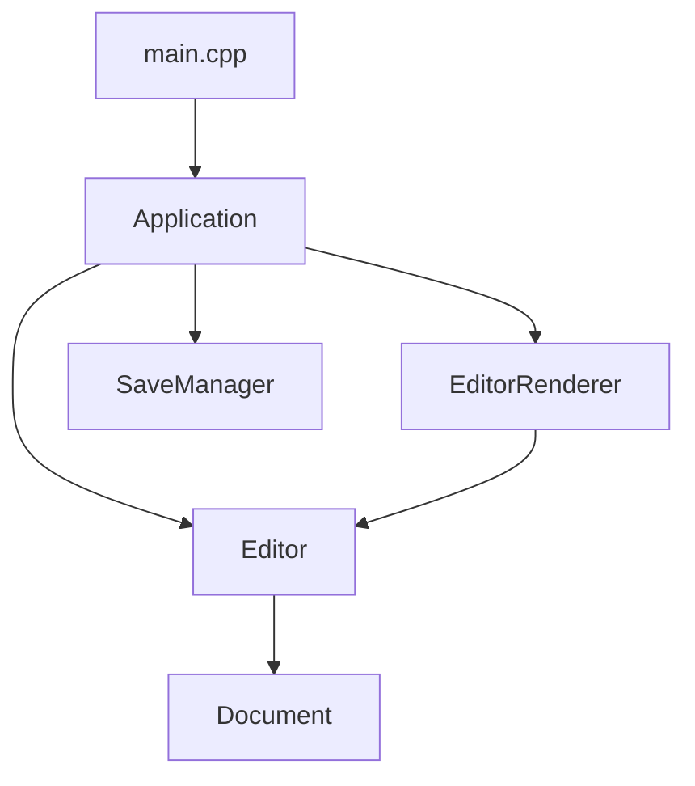

# Sord Architecture Guide

This document outlines the high-level architecture, directory layout, and relationships between the main components of **Sord** (a terminal-based text editor built using C++20 and FTXUI).

## High-Level Components

Sord is divided into distinct modular layers separating UI, rendering, file operations, and editor state management.

### 1. Application Layer (`sord::app`)
* **`Application`** ([application.hpp](file:///home/israfil/Desktop/sord/include/app/application.hpp), [application.cpp](file:///home/israfil/Desktop/sord/src/app/application.cpp)): Manages the main FTXUI event and rendering loop, constructs modal dialogs, and coordinates file management actions.
* **`SaveManager`** ([save_manager.hpp](file:///home/israfil/Desktop/sord/include/app/save_manager.hpp), [save_manager.cpp](file:///home/israfil/Desktop/sord/src/app/save_manager.cpp)): A utility component containing static helpers to handle robust filepath normalization and filesystem write operations safely.

### 2. Rendering Layer (`sord::renderer`)
* **`EditorRenderer`** ([editor_renderer.hpp](file:///home/israfil/Desktop/sord/include/renderer/editor_renderer.hpp), [editor_renderer.cpp](file:///home/israfil/Desktop/sord/src/renderer/editor_renderer.cpp)): Decouples editor representation from terminal constraints. It manages translating raw lines from the document buffer into layouts suitable for display, formatting the toolbar and status bar contents.

### 3. Editor Core (`sord::editor`)
* **`Editor`** ([editor.hpp](file:///home/israfil/Desktop/sord/include/editor/editor.hpp), [editor.cpp](file:///home/israfil/Desktop/sord/src/editor/editor.cpp)): Handles input operations, moving cursors, and editing buffers by dispatching text alterations to the underlying document model.
* **`Document`** ([document.hpp](file:///home/israfil/Desktop/sord/include/editor/document.hpp), [document.cpp](file:///home/israfil/Desktop/sord/src/editor/document.cpp)): Holds the underlying document state (e.g. lines, active selection metadata, title, and lines count).

---

## Directory Layout
* `/src`: Source code (.cpp) implementation.
  * `/src/app`: Application orchestration and file savings.
  * `/src/editor`: Internal states representing documents and characters modifications.
  * `/src/renderer`: Layout render formatters.
* `/include`: C++ header files (.hpp) defining component signatures.
* `/build`: Automatically created output compilation targets (.o, binary).
* `/tests`: Verification tests for backend behavior validation.
